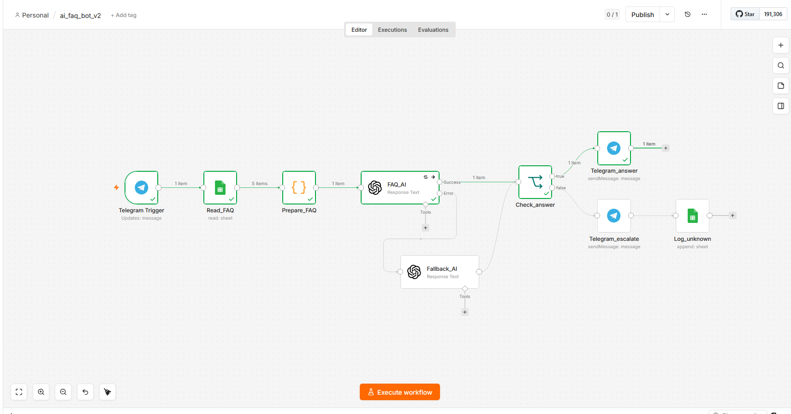

# AI FAQ Bot

Telegram-бот для автоматических ответов на вопросы клиентов по базе знаний.
Неизвестные вопросы передаются менеджеру и логируются.

## Что делает

- Читает базу знаний из Google Sheets
- AI ищет ответ на вопрос пользователя
- Если ответ найден → отвечает дружелюбно
- Если не найден → сообщает что передаёт менеджеру + логирует вопрос

## Архитектура

## Архитектура

```
Telegram Trigger → Read_FAQ → Prepare_FAQ → FAQ_AI → Check_answer
                                                        ↙          ↘
                                               Telegram_answer   Telegram_escalate
                                                                        ↓
                                                                   Log_unknown
```

## Стек

- n8n (Docker, localhost)
- OpenAI GPT-4o-mini
- Telegram Bot API
- Google Sheets (Service Account)

## Google Sheets таблицы

| Таблица | Назначение |
|---------|-----------|
| faq-knowledge-base | База вопросов и ответов |
| faq-unknown-questions | Лог неизвестных вопросов |

## Как запустить

1. Импортируй `ai_faq_bot_v1.json` в n8n
2. Добавь credentials:
   - OpenAI API key
   - Telegram Bot token
   - Google Sheets Service Account
3. Создай две таблицы в Google Sheets
4. Дай доступ Service Account к обеим таблицам
5. Активируй workflow

## Демо



## Бизнес-ценность

Снижает нагрузку на поддержку — бот закрывает типовые вопросы автоматически.
Лог неизвестных вопросов показывает какие темы нужно добавить в базу знаний.

Подходит для: интернет-магазинов, сервисных компаний, малого бизнеса.

## История версий

### v2 — Надёжность
- Добавлен Retry On Fail на ноду FAQ_AI (3 попытки, задержка 5 сек)
- Добавлена резервная нода Fallback_AI (gpt-3.5-turbo) на случай ошибки основной модели
- Оба пути возвращают ответ по единому маршруту output[0].content[0].text

### v1 — Базовая версия
- База знаний в Google Sheets (question / answer)
- OpenAI ищет ответ на вопрос пользователя
- Роутинг: ответ найден → пользователю / не найден → эскалация менеджеру
- Логирование неизвестных вопросов в отдельную таблицу
